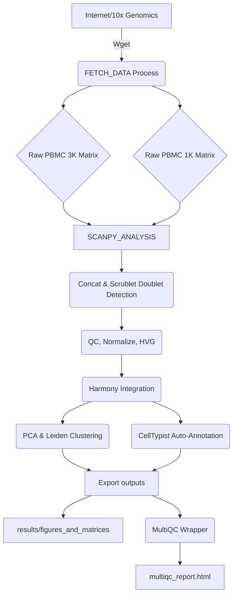
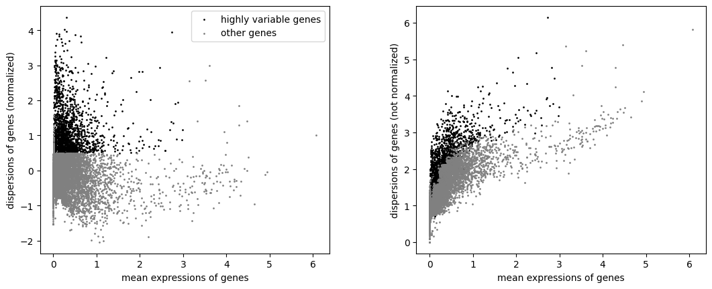
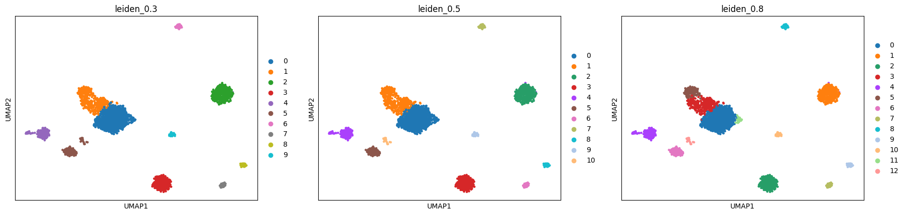
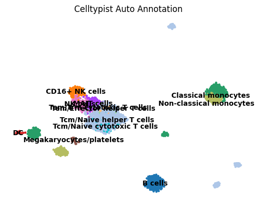

# Dockerized scRNA-Seq Nextflow Pipeline

This repository contains a reproducible, scalable Nextflow pipeline for Single-Cell RNA-Seq analysis. Built with `scanpy`, it handles data fetching, doublet detection, dataset integration, auto-annotation, and clustering out-of-the-box.

## Features Enclosed
* **Scrublet:** Automated doublet detection algorithms
* **Harmony Integration:** Built-in dual-dataset merging and batch effect removal
* **CellTypist:** Applies machine-learning pre-trained models for autonomous cell type prediction
* **Dynamic Resolutions:** Loops multiple Leiden resolutions mapping granularity structures
* **MultiQC Logging:** Comprehensive outputs wrapper for review
* **scVelo (Drafted):** Trajectory code is provided but commented out due to RAM limits (requires specific `.loom` spliced inputs!)

## Pipeline Data Flow Diagram


## Quick Start & Installation

### Requirements
* Nextflow installed locally (`curl -s https://get.nextflow.io | bash`)
* Docker installed and running

### 1. Build the Pipeline Environment
Bake all the python dependencies into your Docker image. This uses the `Dockerfile` to create a virtual, self-contained run environment without dirtying your host OS.
```bash
docker build -t scanpy-analysis:latest .
```

### 2. Run the Analysis
Launch Nextflow. It will orchestrate downloading the PBMC sets and executing the Scanpy pipeline inside the container.
```bash
nextflow run main.nf
```

### Outputs
Once complete, open the `results/` folder! You'll find:
* **`figures/`**: Contains side-by-side UMAP clustering and marker visualization plots.
* **`data/`**: The raw PBMC 1K and 3K cellranger datasets fetched by the pipeline, stored for your convenience.
* **`pbmc_integrated.h5ad`**: The final processed, batch-corrected single-cell dataset.
* **`cell_type_assignments.csv`**: A spreadsheet mapping autonomous machine-learning predictions vs clustering.
* **`multiqc_report.html` & `scanpy_analysis.log`**: Overall pipeline run status and terminal trace logs.

### Pipeline Visualizations

Successfully integrating and clustering the ~4,000 cells reveals multiple distinct populations.

**1. Highly Variable Gene Dispersion (Harmony Integration)**


**2. Dynamic Leiden Resolutions (Granularity Control)**


**3. Autonomous CellTypist Annotations**

