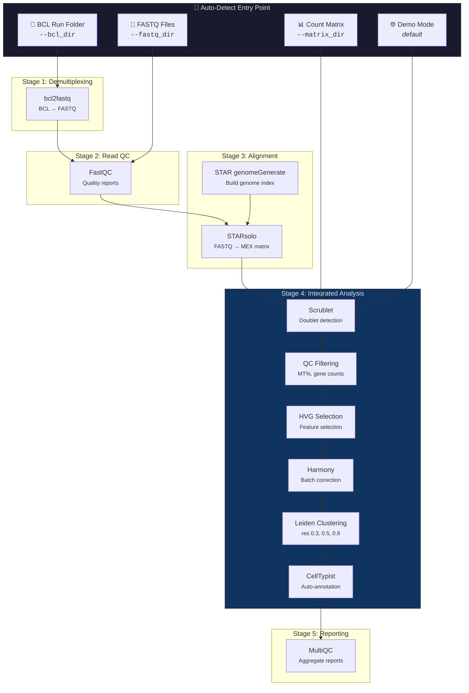
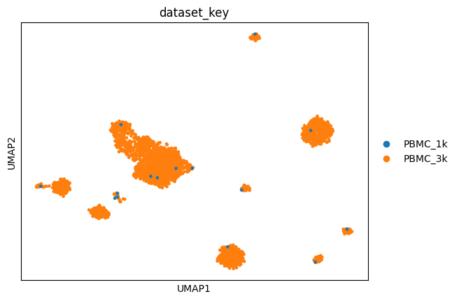

# 🧬 scRNA-Seq: Full-Stack Single-Cell RNA Sequencing Pipeline

A reproducible, Dockerized **Nextflow** pipeline that takes you from raw sequencing output all the way to publication-ready figures. Auto-detects your starting point and runs only the stages you need.

## ✨ Features

| Category | Feature | Tool |
|---|---|---|
| **Demultiplexing** | BCL → FASTQ conversion | `bcl2fastq` v2.20 |
| **Read QC** | Per-base quality, adapter content | `FastQC` v0.12 |
| **Alignment** | FASTQ → count matrix (UMI-aware) | `STARsolo` v2.7.11b |
| **Doublet Detection** | Computational doublet removal | `Scrublet` |
| **Batch Correction** | Multi-dataset integration | `Harmony` |
| **Clustering** | Multi-resolution community detection | Leiden (0.3, 0.5, 0.8) |
| **Auto-Annotation** | ML-based cell type prediction | `CellTypist` (Immune_All_Low) |
| **Trajectory** | RNA velocity (drafted, requires .loom) | `scVelo` (commented out) |
| **Reporting** | Aggregated QC summary | `MultiQC` |

> **Species:** This pipeline defaults to **human (GRCh38)**. Mouse (mm10) support is not included but can be added by providing a mouse genome FASTA + GTF to the `--genome_fasta` and `--genome_gtf` parameters.

---

## 🔄 Pipeline Flow



### Files at Each Stage

| Stage | Input Files | Output Files | Tool |
|---|---|---|---|
| **1. Demultiplex** | `RunInfo.xml`, `SampleSheet.csv`, `*.bcl` | `*_R1_001.fastq.gz`, `*_R2_001.fastq.gz` | bcl2fastq |
| **2. Read QC** | `*.fastq.gz` | `*_fastqc.html`, `*_fastqc.zip` | FastQC |
| **3. Alignment** | `*.fastq.gz`, genome index, barcode whitelist | `barcodes.tsv`, `features.tsv`, `matrix.mtx` | STARsolo |
| **4. Analysis** | MEX matrix directory | `figures/`, `*.h5ad`, `*.csv` | Scanpy + extensions |
| **5. Reporting** | All QC outputs | `multiqc_report.html` | MultiQC |

---

## 💻 Resource Requirements

| Stage | Process | RAM | CPUs | Runs on Laptop? |
|---|---|---|---|---|
| 0 | `FETCH_DATA` (demo) | 1 GB | 1 | ✅ Yes |
| 1 | `BCL2FASTQ` | **64 GB** | 16 | ❌ Server/Cloud |
| 2 | `FASTQC` | 4 GB | 4 | ✅ Yes |
| 3a | `STAR_INDEX` | **32 GB** | 8 | ❌ Server/Cloud |
| 3b | `STARSOLO` | **32 GB** | 8 | ❌ Server/Cloud |
| 4 | `SCANPY_ANALYSIS` | 5 GB | 2 | ✅ Yes |
| 5 | `MULTIQC` | 2 GB | 1 | ✅ Yes |

> ⚠️ **Local machines (≤12 GB RAM):** Use `-profile local` and start from a pre-computed matrix (`--matrix_dir`) or demo mode. Stages 1 and 3 require a server with ≥32 GB RAM.

---

## 🚀 Quick Start

### Prerequisites
* **Docker** installed and running
* **Nextflow** installed (`curl -s https://get.nextflow.io | bash`)

### 1. Build the Analysis Container
```bash
docker build -t scanpy-analysis:latest .
```

### 2. Choose Your Entry Point

#### Demo Mode (no data needed — downloads 10x PBMC datasets)
```bash
nextflow run main.nf -profile local
```

#### Start from Count Matrix (skip all upstream)
```bash
nextflow run main.nf -profile local \
    --matrix_dir /path/to/filtered_feature_bc_matrix
```

#### Start from FASTQs (requires ≥32 GB RAM)
```bash
nextflow run main.nf -profile server \
    --fastq_dir /path/to/fastqs/ \
    --genome_fasta /path/to/GRCh38.fa \
    --genome_gtf /path/to/gencode.v44.gtf
```

#### Start from BCL (full pipeline, requires ≥64 GB RAM)
```bash
nextflow run main.nf -profile server \
    --bcl_dir /path/to/sequencing_run/ \
    --sample_sheet /path/to/SampleSheet.csv \
    --genome_fasta /path/to/GRCh38.fa \
    --genome_gtf /path/to/gencode.v44.gtf
```

#### Using a Pre-Built STAR Index (skip genome indexing)
```bash
nextflow run main.nf -profile server \
    --fastq_dir /path/to/fastqs/ \
    --star_index /path/to/star_index/
```

### 3. View Results
All outputs are published to the `results/` directory:

| Path | Contents |
|---|---|
| `results/figures/` | UMAP plots, QC violin plots, marker visualizations |
| `results/data/` | Raw datasets (demo mode only) |
| `results/fastqs/` | Demultiplexed FASTQ files (BCL entry only) |
| `results/fastqc/` | FastQC HTML reports (FASTQ/BCL entry) |
| `results/starsolo/` | STARsolo count matrices and BAMs (FASTQ/BCL entry) |
| `results/pbmc_integrated.h5ad` | Final annotated AnnData object |
| `results/cell_type_assignments.csv` | Cell type predictions + cluster labels |
| `results/multiqc_report.html` | Aggregated QC report |
| `results/scanpy_analysis.log` | Full analysis terminal log |

---

## 📊 Pipeline Visualizations

Successfully integrating and clustering the ~4,000 cells reveals multiple distinct populations.

**1. Highly Variable Gene Dispersion (Harmony Integration)**


**2. Dynamic Leiden Resolutions (Granularity Control)**


**3. Autonomous CellTypist Annotations**


**4. Batch Integration Comparison**


---

## 📁 Sample Sheet Template

For multi-sample FASTQ runs, create a CSV with the following format (see `assets/sample_sheet_template.csv`):

```csv
sample_id,fastq_1,fastq_2
PBMC_3k,/path/to/PBMC_3k_S1_L001_R1_001.fastq.gz,/path/to/PBMC_3k_S1_L001_R2_001.fastq.gz
PBMC_1k,/path/to/PBMC_1k_S2_L001_R1_001.fastq.gz,/path/to/PBMC_1k_S2_L001_R2_001.fastq.gz
```

---

## 🧬 10x Barcode Whitelist

STARsolo requires a barcode whitelist for cell barcode matching. The pipeline automatically downloads the **10x Chromium v3** whitelist (`3M-february-2018.txt`) at runtime if not found locally.

To pre-download manually:
```bash
wget https://github.com/10XGenomics/cellranger/raw/master/lib/python/cellranger/barcodes/3M-february-2018.txt.gz
gunzip 3M-february-2018.txt.gz
mv 3M-february-2018.txt assets/whitelists/
```

---

## 🔧 Configuration Profiles

| Profile | Command | Use Case |
|---|---|---|
| `local` | `-profile local` | Laptops/desktops (≤12 GB RAM). Demo mode and matrix entry only. |
| `server` | `-profile server` | HPC/cloud (≥64 GB RAM). Full pipeline from BCL or FASTQ. |

---

## 📝 License

This project is open source. The upstream tools (bcl2fastq, STAR, FastQC) are subject to their respective licenses.